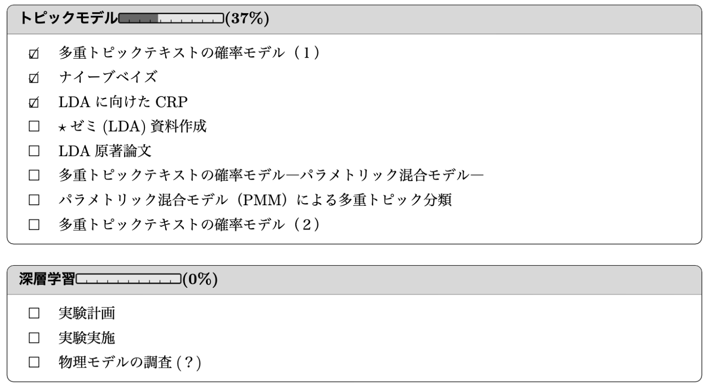
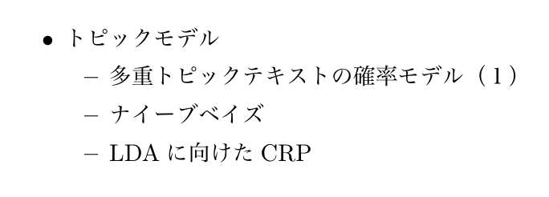

# WunderlisTeX
WunderlistのタスクをLaTeXで可視化できるようにする

# Introduction

手軽なタスク管理ツールを利用したくなり，更にはその結果がLaTeX製資料に掲載できれば嬉しいと考えた．
そのアイデアを形にしたアプリケーションである．

[Wunderlist](https://www.wunderlist.com)が提供しているAPIを利用し，タスクのリスト毎に表スタイルのタスク管理表と，一週間内に行ったタスクを可視化できる．

# Demo

### ToDo List

### Done task for the last week

### Sample PDF
[Here](tex/test.pdf)

# Installation

### Get Wunderlist API's key
Go [Wunderlist Developer](https://developer.wunderlist.com/) and resistor information.

Next, get `CLIENT ID` and `ACCESS TOKEN`(push `CREATE ACCESS TOKEN`).

Finally, modify [`tex/secret.yaml`](tex/secret.yaml) in tex directory.

### Install Docker
Check [Docker Documentation](https://docs.docker.com/) and install docker.

# Usage

### LaTeX command

* `\todotable`

    * Making all ToDo list

* `\doneitem`

    * Making done task for the last week

### Compile test.tex and Make PDF

1. Modify [`tex/test.tex`](tex/test.tex) what you want.

2. Execute this command in this directory which [`Dockerfile`](Dockerfile) exists.

~~~sh
docker build -t <image name> .
docker run -it -p 8000:8000 <image name>
~~~

3. Now, you can see PDF in [http://localhost:8000](http://localhost:8000).

If you want to know this app, read [Dockerfile](Dockerfile).
